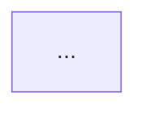
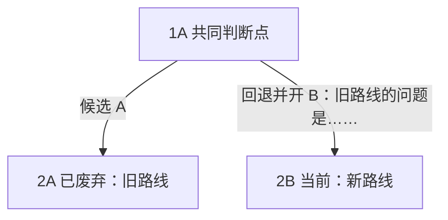
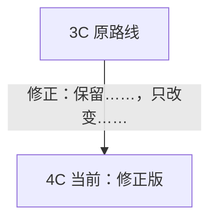
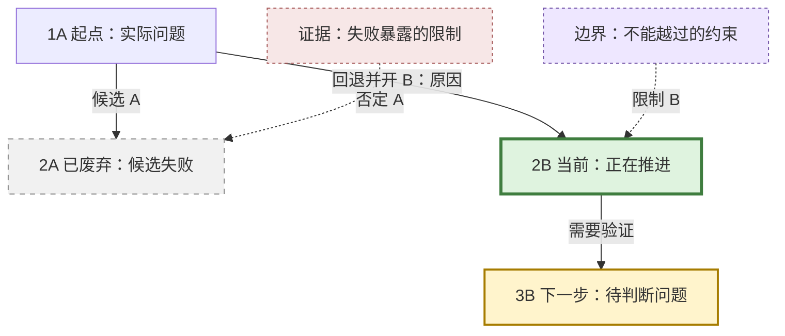

# Workflow Route Mapper

## 目标

把复杂任务的探索过程整理成可回看的 Mermaid 路线图，使用户只看图就能知道：探索从哪里开始、为什么分叉、哪些路线被修正或放弃、当前走到哪里、下一步是什么。

路线图记录路线演化，不重复保存项目说明。普通纠偏、偏好蒸馏和当前目标、上下文、输出形态、边界的维护使用 `workflow-state-distiller`。两者同时需要时，当前任务责任人先用 `workflow-state-distiller` 确定当前有效状态和改变路线的证据，本 Skill 据此更新路线图。路线图作为后续判断的证据返回责任人，不成为另一份当前状态。

## 默认产物

路线图文档默认只包含标题和 Mermaid：

````markdown
# <任务名> 路线图


````

图中已经表达的信息不在图外重复。只有用户明确要求另一种产物时，才另外生成说明、当前结构图或状态摘要。

路线图写入独立 Markdown 文档。位置优先遵循用户指定位置或项目既有 docs/wiki 结构。没有约定时使用 `docs/workflow-state/<topic>.md`。聊天回复只提供文件链接和必要的一句话结果，不复制整份路线说明。

如果一张图无法渲染，或者无法从路线起点连续跟到当前节点而不穿过无关分支，使用一张保留全局分叉关系的总图，再用少量 Mermaid 详图展开局部。

## 记录什么

只记录会改变后续判断的内容：

- 用户目的或问题发生实质修正。
- 候选假设形成独立路线。
- 实际行动或实验产生了改变判断的证据。
- 失败形成新边界、改变目标、验证方式或后续路线。
- 路线被否定、暂停、吸收、废弃或恢复。
- 当前路线、待决分叉和下一步。

已经解决且不再产生约束的临时报错、命令失误、实现杂事和聊天过程不进入路线图。若删除一项后仍能理解为什么形成当前路线，就不记录它。

当本 skill 在任务中途才被调用，先读取现有路线图和直接改变过路线判断的材料。只恢复能够确认的路线。不确定内容标为“待确认”，不要为了图完整而猜测。

## 编号与路线

- 数字表示问题结构中的深度，不表示创建顺序。
- 字母串表示路线。按 `A-Z, AA, AB...` 延展。
- 路线节点写成 `1A`、`2A`、`2B`、`12AA`。
- 同一路线继续深入时保留字母。真正开出另一条路线时更换字母。
- 同一父节点产生的并列路线通常深度相同、字母不同。
- 回退本身不单独编号。在开出新路线的连接线上写明回退原因。
- 当前推进路线可以同时有多条，通过节点文字和样式直接标出，不在图外另建状态表。
- 证据、校准和边界等旁挂节点不显示路线编号，直接写“证据：……”“边界：……”“校准：……”，避免与路线编号混淆。

## 节点与连接线

- 一个路线节点承载一个独立判断。同一状态下、由同一证据支持并通向同一后续分支的信息可以合并。
- 节点写清实际对象、状态和当前判断，避免“锚点”“继续细化”“形成候选”等缺少实际含义的词。
- 快速节点优先写成“编号 + 状态 + 对象 + 判断”，例如 `17AD 已确认：军务第一版影响征召兵数量`。
- 连接线说明为什么发生推进、分叉、修正或回退，优先写用户确认、用户修正、证据、风险或实现缺口。
- 实线 `-->` 表示路线推进、分叉或保留核心前提的修正。
- 虚线 `-.->` 表示证据、校准、边界或跨路线吸收，不把旁挂信息伪装成路线推进。

## 分叉语义

否定表示放弃路线核心。被否定路线和新路线从最近的共同判断点并行分叉，不画成“被否定路线 → 新路线”：



修正保留旧路线核心，只调整做法或边界，可以顺承：



失败直接触发修复且仍保留原路线核心时，画成“失败证据 → 修复行动 → 重新验证”。新路线只吸收旧路线的一部分时，用虚线或带“吸收”文字的边表达，不用主边伪装成整体继承。

## 图形状态

通过节点文字和少量样式区分当前、下一步、暂停、废弃以及旁挂证据或边界。状态必须在黑白或样式失效时仍可从节点文字读懂。



## 维护流程

1. 判断是否出现了值得保存的路线变化。
2. 读取现有路线图和会改变判断的证据，不重新整理全部聊天历史。
3. 更新共同判断点、分叉、失败链、当前节点和下一步。
4. 旧文档有重复章节时，先把其中仍会影响路线理解的信息移入节点或边，再删除重复内容。
5. 检查分叉关系、当前状态和下一步是否只看图就能理解。

## 验收

- 用户只看 Mermaid 就能理解路线怎样形成、现在处于哪里、下一步是什么。
- 分叉、修正和失败表达实际逻辑。改变过路线的取舍保留，不再影响当前路线的过程不进入图。
- 同一信息不在节点、边和图外重复，默认文档除标题和必要的图块标识外没有正文。
